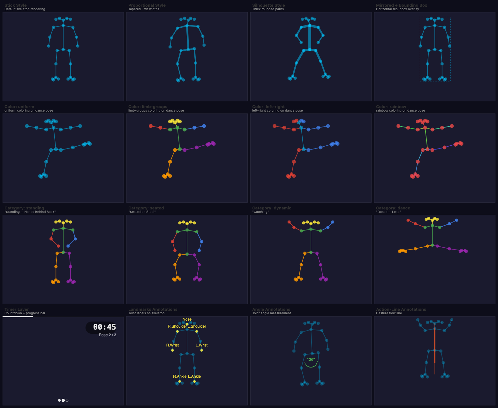
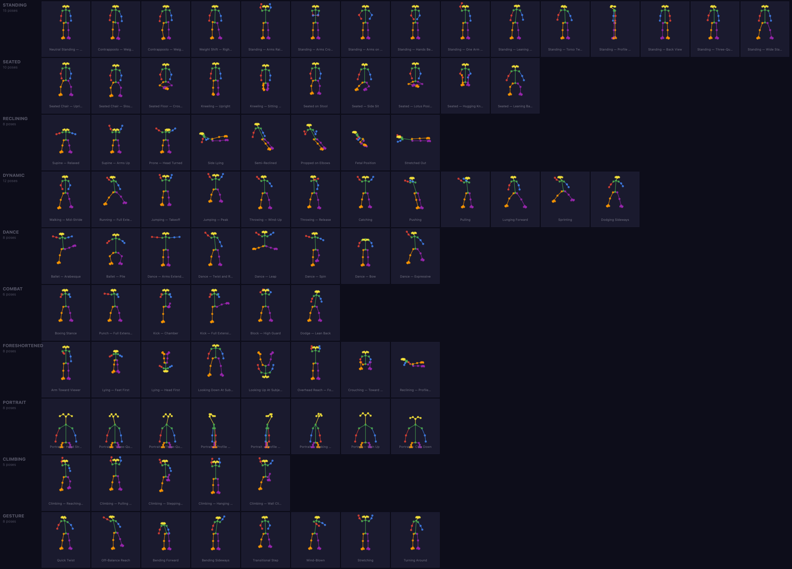

# @genart-dev/plugin-poses

Pose reference and practice plugin for [genart.dev](https://genart.dev) — overlay OpenPose BODY_25 skeletons on any sketch, run timed practice sessions with auto-advancing poses, and annotate with landmarks, angles, and action lines. All layers are non-destructive guides. Includes 88 preset poses across 10 categories and 8 MCP tools for AI-agent control.

Part of [genart.dev](https://genart.dev) — a generative art platform with an MCP server, desktop app, and IDE extensions.

## Install

```bash
npm install @genart-dev/plugin-poses
```

## Usage

```typescript
import posesPlugin from "@genart-dev/plugin-poses";
import { createDefaultRegistry } from "@genart-dev/core";

const registry = createDefaultRegistry();
registry.registerPlugin(posesPlugin);

// Or access individual layer types, pose library, and utilities
import {
  skeletonLayerType,
  timerLayerType,
  annotationsLayerType,
  posesMcpTools,
  getAllPoses,
  filterPoses,
  getRandomPoses,
  getPoseById,
  getPoseCategories,
  BODY_25_NAMES,
  LIMB_CONNECTIONS,
} from "@genart-dev/plugin-poses";
```

## Layer Types (3)

### Common Guide Properties

Shared by all three layer types:

| Property | Type | Default | Description |
|----------|------|---------|-------------|
| `guideColor` | color | `"rgba(0,200,255,0.5)"` | Guide line color |
| `lineWidth` | number | `1` | Line width in pixels (0.5-5) |
| `dashPattern` | string | `""` | CSS dash pattern |

### Pose Skeleton (`poses:skeleton`, guide)

OpenPose BODY_25 skeleton overlay with 25 keypoints and 24 limb connections. Supports three rendering styles and four color modes.

| Property | Type | Default | Description |
|----------|------|---------|-------------|
| `poseData` | string (JSON) | `"{}"` | PoseData with keypoints, source, label |
| `skeletonStyle` | select | `"stick"` | stick / proportional / silhouette |
| `jointStyle` | select | `"circle"` | circle / diamond |
| `jointRadius` | number | `5` | Joint marker radius (2-15) |
| `limbWidth` | number | `2` | Base limb width (1-8) |
| `showConfidence` | boolean | `false` | Vary opacity by keypoint confidence |
| `colorMode` | select | `"uniform"` | uniform / limb-groups / left-right / rainbow |
| `leftColor` | color | `"rgba(66,133,244,0.8)"` | Left-side color (left-right mode) |
| `rightColor` | color | `"rgba(234,67,53,0.8)"` | Right-side color (left-right mode) |
| `highlightJoints` | string (JSON) | `"[]"` | Array of keypoint names to highlight |
| `showBoundingBox` | boolean | `false` | Show bounding box around pose |
| `mirror` | boolean | `false` | Horizontally flip the skeleton |
| `poseLabel` | string | `""` | Label displayed below the skeleton |

### Practice Timer (`poses:timer`, guide)

Countdown timer for timed practice sessions with pose counter and progress bar.

| Property | Type | Default | Description |
|----------|------|---------|-------------|
| `sessionData` | string (JSON) | `"{}"` | SessionData with pose queue and durations |
| `currentPoseIndex` | number | `0` | Current pose index in session |
| `timerRemaining` | number | `120` | Seconds remaining (0-1800) |
| `timerDuration` | number | `120` | Total duration per pose (10-1800) |
| `showTimer` | boolean | `true` | Show timer display |
| `timerPosition` | select | `"top-right"` | top-left / top-right / bottom-left / bottom-right / center-top |
| `timerSize` | number | `32` | Timer font size (16-64) |
| `showProgress` | boolean | `false` | Show progress bar and dots |
| `timerColor` | color | `"#ffffff"` | Timer text color |
| `bgColor` | color | `"rgba(0,0,0,0.6)"` | Timer background color |

### Study Annotations (`poses:annotations`, guide)

Overlays for anatomical study — landmark labels, angle arcs, distance lines, and gesture action lines.

| Property | Type | Default | Description |
|----------|------|---------|-------------|
| `annotations` | string (JSON) | `"[]"` | Array of AnnotationItem objects |
| `referenceLayerId` | string | `""` | ID of skeleton layer to reference |
| `annotationType` | select | `"landmarks"` | landmarks / angles / distances / action-lines / all |
| `annotationColor` | color | `"rgba(255,235,59,0.8)"` | Annotation highlight color |
| `fontSize` | number | `12` | Label font size (8-24) |
| `showLabels` | boolean | `true` | Show text labels |

## Test Render



16-panel montage showing all layer types with variations:
- **Row 1**: Skeleton styles — stick, proportional, silhouette, mirrored with bounding box
- **Row 2**: Color modes — uniform, limb-groups, left-right, rainbow
- **Row 3**: Pose categories — standing, seated, dynamic, dance (from 88 presets across 10 categories)
- **Row 4**: Timer layer, landmark annotations, angle annotations, action-line annotations

Source: [`test-renders/poses-montage.genart`](test-renders/poses-montage.genart). Regenerate with `bash test-renders/render.sh`.

### All 88 Poses



Every preset pose grouped by category — 10 rows, one per category. Source: [`test-renders/all-poses.genart`](test-renders/all-poses.genart).

## Pose Library (88 presets)

| Category | Count | Description |
|----------|-------|-------------|
| standing | 15 | Neutral, contrapposto, weight shift, arms variations |
| seated | 10 | Chair, floor, kneeling, lotus |
| reclining | 8 | Supine, prone, side-lying, fetal |
| dynamic | 12 | Walking, running, jumping, throwing, pushing |
| dance | 8 | Arabesque, plie, leap, spin |
| combat | 6 | Boxing stance, punch, kick, block |
| foreshortened | 8 | Arm toward camera, lying feet-first, overhead reach |
| portrait | 8 | Head straight, three-quarter, profile, over-shoulder |
| climbing | 5 | Reaching up, pulling, hanging, wall climb |
| gesture | 8 | Quick twist, off-balance, wind-blown, transitional |

Each preset contains 25 BODY_25 keypoints with normalized (0-1) coordinates. Filter by tags:

```typescript
import { filterPoses, getRandomPoses } from "@genart-dev/plugin-poses";

// Filter by category, view, difficulty, energy, symmetry, weight
const dynamicFront = filterPoses({ category: "dynamic", view: "front" });

// Seeded random selection with optional filter
const session = getRandomPoses(5, { difficulty: "beginner" }, 42);
```

## MCP Tools (8)

| Tool | Description |
|------|-------------|
| `add_pose_skeleton` | Add a skeleton layer from a preset ID, category name, or custom keypoints |
| `set_pose_keypoints` | Update keypoints on an existing skeleton layer |
| `create_practice_session` | Create a timed practice session (gesture / sustained / progressive / custom) |
| `advance_pose` | Advance to the next pose in a practice session |
| `annotate_pose` | Add study annotations (landmarks, angles, distances, action lines) |
| `analyze_pose` | Return JSON analysis: angles, proportions, center of gravity, symmetry score |
| `randomize_pose` | Add a random pose with optional tag filter |
| `clear_pose_layers` | Remove all `poses:*` layers |

## Exported Utilities

Shared BODY_25 constants and drawing helpers are exported for reuse:

- `BODY_25_NAMES` — 25 keypoint names as const tuple
- `LIMB_CONNECTIONS` — 24 limb connections as `[KeypointName, KeypointName][]`
- `LIMB_GROUPS` / `LIMB_GROUP_COLORS` — 6 body groups with colors
- `PROPORTIONAL_WIDTHS` — per-limb-segment width multipliers
- `denormalizeKeypoints()` — convert normalized coords to pixel bounds
- `mirrorKeypoints()` — horizontal flip
- `computeAngle()` — three-point joint angle
- `computeCenterOfGravity()` — average keypoint position
- `computeSymmetryScore()` — left-right symmetry metric

## Types

```typescript
import type {
  KeypointName,
  Keypoint,
  KeypointMap,
  PoseData,
  PoseCategory,
  PoseTags,
  PosePreset,
  SessionData,
  AnnotationItem,
} from "@genart-dev/plugin-poses";
```

## Related Packages

| Package | Purpose |
|---------|---------|
| [`@genart-dev/core`](https://github.com/genart-dev/core) | Plugin host, layer system (dependency) |
| [`@genart-dev/plugin-perspective`](https://github.com/genart-dev/plugin-perspective) | Perspective grids and floor planes |
| [`@genart-dev/plugin-layout-guides`](https://github.com/genart-dev/plugin-layout-guides) | Composition guides (rule of thirds, golden ratio, grid) |
| [`@genart-dev/mcp-server`](https://github.com/genart-dev/mcp-server) | MCP server that surfaces plugin tools to AI agents |

## Support

Questions, bugs, or feedback — [support@genart.dev](mailto:support@genart.dev) or [open an issue](https://github.com/genart-dev/plugin-poses/issues).

## License

MIT
